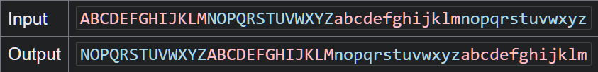

# Bandit

## Bookmark
```bash
ssh bandit14@bandit.labs.overthewire.org -p 2220
```

## Levels

### [0](https://overthewire.org/wargames/bandit/bandit0.html)
Connect to ssh with username **bandit0** 
```bash
ssh bandit0@bandit.labs.overthewire.org -p 2220
```

### [0 -> 1](https://overthewire.org/wargames/bandit/bandit1.html)
Read the `readme` file in the home directory
```bash
cat readme
```

### [1 -> 2](https://overthewire.org/wargames/bandit/bandit2.html)
Read the file `-` by using the full path
```bash
cat ./-
```

### [2 -> 3](https://overthewire.org/wargames/bandit/bandit3.html)
```bash
cat ./"--spaces in this filename--"
```

### [3 -> 4](https://overthewire.org/wargames/bandit/bandit4.html)
```bash
cd inhere
ls -a
cat ...Hiding-From-You
```

### [4 -> 5](https://overthewire.org/wargames/bandit/bandit5.html)
```bash
file ./*
./-file00: data
./-file01: data
./-file02: data
./-file03: data
./-file04: data
./-file05: data
./-file06: data
./-file07: ASCII text
./-file08: data
./-file09: data
```
```bash
cat ./-file07
```

### [5 -> 6](https://overthewire.org/wargames/bandit/bandit6.html)
```bash
cd inhere
ls
maybehere00  maybehere04  maybehere08  maybehere12  maybehere16
maybehere01  maybehere05  maybehere09  maybehere13  maybehere17
maybehere02  maybehere06  maybehere10  maybehere14  maybehere18
maybehere03  maybehere07  maybehere11  maybehere15  maybehere19
```
```bash
find -type f -size 1033c
./maybehere07/.file2
```
```bash
cat $(!!)
```
* The `$(!!)` shortcut recomputes the last command.  
In this case it expands to `cat $(find -type f -size 1033c)`

### [6 -> 7](https://overthewire.org/wargames/bandit/bandit7.html)
```bash
find / -type f -user bandit7 -group bandit6 -size 33c 2>/dev/null
/var/lib/dpkg/info/bandit7.password
```
* `2>/dev/null` hides all the 'Permission denied' files output
```bash
cat $(!!)
```

### [7 -> 8](https://overthewire.org/wargames/bandit/bandit8.html)
```bash
grep "millionth" data.txt
```

### [8 -> 9](https://overthewire.org/wargames/bandit/bandit9.html)
```bash
sort data.txt | uniq -u
```
* `uniq` filters only adjacent lines. So we need to `sort` them first
* `-d` ignores duplicates and only prints unique lines

### [9 -> 10](https://overthewire.org/wargames/bandit/bandit10.html)
```bash
grep -ao "==\{2,\} \w*" data.txt
```
* `-a` reads a binary file as text
* `-o` only prints matching characters
```terminal
========== the
========== password
========== is
========== B0s2khmbT9u0geKuOoVGW3JZKhndE3BG
```

### [10 -> 11](https://overthewire.org/wargames/bandit/bandit11.html)
```bash
base64 -d data.txt
```

### [11 -> 12](https://overthewire.org/wargames/bandit/bandit12.html)
```bash
cat data.txt | tr 'A-Za-z' 'N-ZA-Mn-za-m'
```
* Translate characters from alphabetic ordered input (data.exe) to the alphabet shifted by 13


### [12 -> 13](https://overthewire.org/wargames/bandit/bandit13.html)
```bash
mktemp -d
/tmp/tmp.a5Mw7cDrIa

cd /tmp/tmp.a5Mw7cDrIa
cp ~/data.txt .
xxd -r data.txt >> data
```
* `xxd -r`: reverts an hex dump into the original file
```bash
file data
data: gzip compressed data, was "data2.bin", last modified: Sat Sep 26 21:54:21 2026, max compression, from Unix, original size modulo 2^32 584

mv data data.gz && gzip -d data.gz
ls
data  data.txt
```
* `gzip -d`: decompress option for gzip
```bash
file data
data: bzip2 compressed data, block size = 900k

mv data data.bz2 && bzip2 -d data.bz2
ls
data  data.txt
```
* `bzip2 -d` decompress option for bzip2
```bash
file data
data: gzip compressed data, was "data4.bin", last modified: Sat Sep 26 21:54:21 2026, max compression, from Unix, original size modulo 2^32 20480

mv data data.gz && gzip -d data.gz
ls
data  data.txt
file data
data: POSIX tar archive (GNU)

mv data data.tar && tar -xf data.tar
ls
data.tar  data.txt  data5.bin

rm data.tar
```
* `tar -x`: extract option for tar
* `tar -f`: the file to extract from
```bash
file data5.bin
data5.bin: POSIX tar archive (GNU)

tar -xf data5.bin
ls
data.txt  data5.bin  data6.bin

rm data5.bin
file data6.bin
data6.bin: bzip2 compressed data, block size = 900k

mv data6.bin data.bz2 && bzip2 -d data.bz2
ls
data  data.txt

file data
data: POSIX tar archive (GNU)

tar -xf data
ls
data  data.txt  data8.bin

rm data
file data8.bin
data8.bin: gzip compressed data, was "data9.bin", last modified: Sat Sep 26 21:54:21 2026, max compression, from Unix, original size modulo 2^32 49

mv data8.bin data.gz && gzip -d data.gz
ls
data  data.txt

file data
data: ASCII text

cat data
```

### [13 -> 14](https://overthewire.org/wargames/bandit/bandit14.html)
```bash
ls
HINT  sshkey.private

cat sshkey.private
```
* copy the key
```bash
exit
echo "(paste the key)" >> sshkey.private
```
* `exit` first to connect to the server from local
```bash
chmod 0600 sshkey.private
ssh -i './sshkey.private' bandit14@bandit.labs.overthewire.org -p 2220
```
* `chmod 0600`: protect the private key file