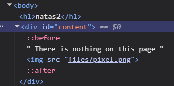
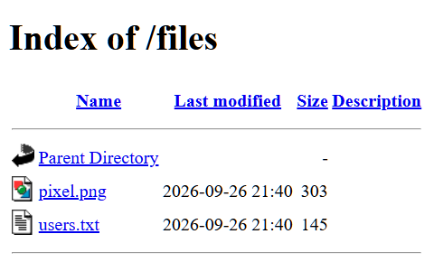

# Natas

## Levels

### [0](https://overthewire.org/wargames/natas/natas0.html)
<http://natas0.natas.labs.overthewire.org>
* Copy-paste the username and password

### [0 -> 1](https://overthewire.org/wargames/natas/natas1.html)
<http://natas0.natas.labs.overthewire.org>
* Copy-paste the username
* The password is in a comment in the source code
* `F12` to open devtools. Then modify the comment and copy the password

### [1 -> 2](https://overthewire.org/wargames/natas/natas2.html)
<http://natas1.natas.labs.overthewire.org>
* As before, open the devtools. Right clicking is disabled so it can only be opened with `F12`

### [2 -> 3](https://overthewire.org/wargames/natas/natas3.html)
<http://natas2.natas.labs.overthewire.org>

* There's an image in the files folder of the site. Navigate there by adding `/files` to the url

* Open `users.txt` by adding `/files/users.txt` to the url

<!-- ### [3 -> 4](https://overthewire.org/wargames/natas/natas4.html)
<http://natas3.natas.labs.overthewire.org> -->
